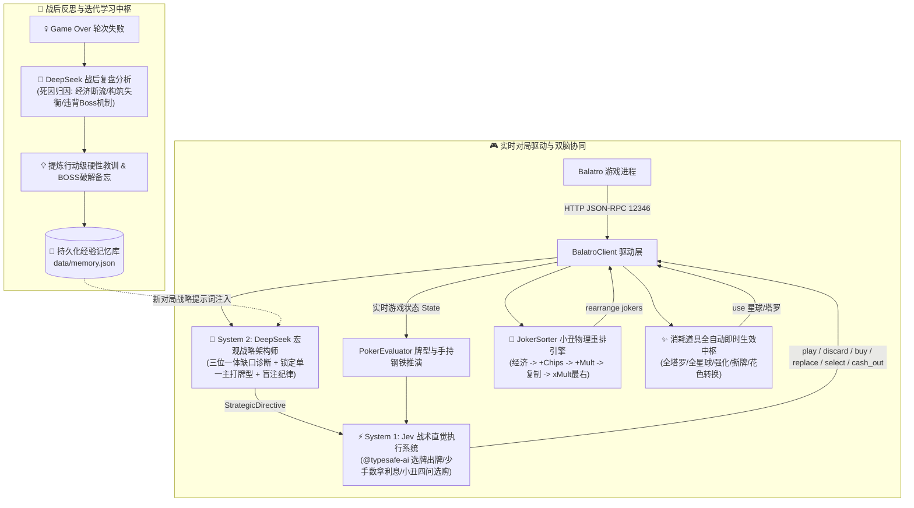

# 🃏 Balatro Dual-Agent (小丑牌双脑协同自主对弈系统)

[](https://www.typescriptlang.org/)
[](https://opensource.org/licenses/ISC)
[](https://platform.deepseek.com/)
[-System%201%20Tactics-purple.svg)](https://typesafe.ai/)

基于 **DeepSeek**（System 2 宏观战略规划与战后反思）与 **Jev**（System 1 战术直觉与实时操控）的双脑协同自主对战《小丑牌》(Balatro) AI 系统。融入《小丑牌高分秘诀：先搭好引擎，再追求爆分》大师级打法，具备筹码×倍率三位一体缺口诊断、小丑牌物理重排、全量道具即时生效与失败自进化闭环。

---

## 🌟 核心特性 (Key Features)

### 1. 🧠 双脑协同架构 (Dual-Brain Architecture)
- **System 2 宏观战略导师 (DeepSeek)**:
  - **三位一体引擎诊断**：动态追踪 `筹码 (Chips)`、`加法倍率 (+Mult)`、`乘法倍率 (×Mult)`，精准指出当前构筑短板；
  - **单主流派专注论**：锁定单一主打牌型（高牌、对子、同花等），集中倾斜星球牌与塔罗牌资源；
  - **历史教训注入**：对局前自动提取过往阵亡死因与 BOSS 破解备忘录。
- **System 1 战术直觉大脑 (Jev / @typesafe-ai)**:
  - **毫秒级全排列推演**：穷举手牌所有出牌与弃牌组合，精准核算手牌分数与手持钢铁卡加成；
  - **少手数一击斩杀**：尽可能 1 手秒杀通关，保留剩余出牌手数兑换过关现金奖金；
  - **小丑四问选购与置换**：守死 $\$25$ 满利息线，小丑满格绝对禁刷，衰减报废小丑智能置换神卡。

### 2. 🔀 小丑物理自动重排引擎 (`JokerSorter`)
依据游戏小丑结算从左到右生效的物理铁律，出牌前通过 RPC API 自动优化排列：
$$\text{[经济/功能]} \longrightarrow \text{[+筹码 (Chips)]} \longrightarrow \text{[+加法倍率 (+Mult)]} \longrightarrow \text{[×乘法倍率 (×Mult) 最右端]}$$
彻底杜绝倍率反向计算导致的巨额伤害亏损，自动对齐复制小丑（Blueprint/Brainstorm）。

### 3. ✨ 全量消耗道具自动即时生效中枢
- **全部星球牌即买即用**：木星、地球、冥王星、水星等进店秒用，永久提升牌型等级底数，0 空间占用；
- **全塔罗覆盖**：
  - 经济类：隐士 (The Hermit 金币翻倍)、节制 (Temperance 变现)；
  - 资源类：女祭司、皇帝、愚者、审判 (免费召小丑)、命运之轮 (概率镀金)；
  - 卡组精简与强化：倒吊人 (撕毁2张低点杂牌)、战车 (钢铁卡手持x1.5)、恶魔 (黄金卡)、正义 (玻璃卡x2)、万能卡与花色转换。

### 4. 🔄 战后深度复盘与自进化记忆库 (`MemoryManager`)
- 挑战失败时黑匣子持久化，记录阵亡底注、金币、小丑配置、差额与 BOSS 机制；
- 提炼行动级避坑硬指令，持久化存储于 `data/memory.json`，代际持续进化。

### 5. 🌐 差异化网络路由
- **Jev 模型**：支持指定 SOCKS5 / HTTP 本地网络代理（如 `socks5://127.0.0.1:12450`），保障海外专线通畅；
- **DeepSeek 模型**：强制锁定原生直连（Bypass Any Proxy），保障国内节点超低延迟响应。

---

## 🏗️ 架构图解



---

## 📁 项目目录结构

```
balatro-dual-agent/
├── data/
│   └── memory.json            # 历史对局反思记忆库与进化教训
├── src/
│   ├── config.ts              # 环境与对战配置
│   ├── types.ts               # 数据契约定义
│   ├── index.ts               # 主运行守护进程
│   ├── test-api.ts            # API 通信与货架状态检查
│   ├── test-network.ts        # 差异化网络路由自检
│   ├── test-shop-policy.ts    # 商店策略与置换单测
│   ├── test-memory.ts         # 经验记忆与反思系统测试
│   ├── capture.ts             # 游戏画面实时抓取
│   ├── driver/
│   │   └── balatro-client.ts  # BalatroBot JSON-RPC 2.0 驱动
│   └── engine/
│       ├── rules.ts           # 小丑牌高分秘诀引擎论与大师百科
│       ├── memory-manager.ts  # 经验记忆与教训演进管理器
│       ├── poker-evaluator.ts # 牌型推演引擎 (含手持钢铁卡与斩杀加权)
│       ├── joker-sorter.ts    # 小丑牌物理重排引擎
│       ├── deepseek-agent.ts  # DeepSeek System 2 战略与反思大脑
│       ├── jev-agent.ts       # Jev System 1 战术直觉大脑 (带代理支持)
│       └── cooperative-conductor.ts # 双脑总控调度器
├── .env.example               # 环境变量模板
├── package.json
└── tsconfig.json
```

---

## 🚀 快速开始

### 1. 环境准备
- Node.js 18+
- 安装依赖：
```bash
npm install
```

### 2. 配置环境变量
复制并修改 `.env` 文件：
```bash
cp .env.example .env
```
填写你的 API Key 与配置：
```ini
# TypeSafe AI Jev API Key
TYPESAFE_API_KEY=your_typesafe_api_key_here
# Jev 专属代理（支持 HTTP/SOCKS5，如 socks5://127.0.0.1:12450；留空则直连）
JEV_PROXY_URL=socks5://127.0.0.1:12450

# DeepSeek API Key
DEEPSEEK_API_KEY=your_deepseek_api_key_here
DEEPSEEK_BASE_URL=https://api.deepseek.com
DEEPSEEK_MODEL=deepseek-flash
# DeepSeek 保持直连
DEEPSEEK_DIRECT=true

# 游戏本体路径
BALATRO_EXE=E:\Games\Balatro\Balatro.exe
```

### 3. 运行自检验证
```bash
# 验证网络路由（Jev 代理 + DeepSeek 直连）
npm run test:network

# 验证与游戏客户端的通信
npm run test:api

# 验证牌型推演与手持钢铁卡加成
npm run test:hand

# 验证商店防盲刷与衰减小丑置换单测
npx tsx src/test-shop-policy.ts
```

### 4. 开启全自动自主托管对战
```bash
npm start
```

---

## 📜 鸣谢与致谢
- [Balatro](https://store.steampowered.com/app/2379780/Balatro/) by LocalThunk
- [DeepSeek AI](https://www.deepseek.com/)
- [TypeSafe AI Jev](https://typesafe.ai/)
- [BalatroBot](https://github.com/balatrobot/balatrobot)
